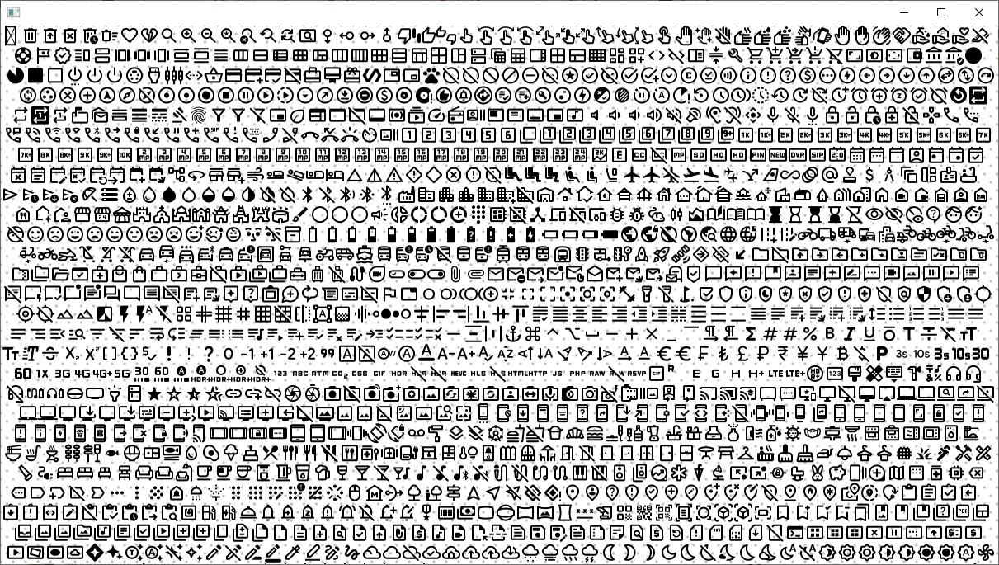

# GlyphReader
Java project for parsing true type font

# References

1. Resource to generate font atlas
    1. https://fonts.varg.dev/
2. Basic concept of glyph display and text rendering
    1. https://www.warp.dev/blog/adventures-text-rendering-kerning-glyph-atlases
3. Font TTF Parsing
    1. Intro (start here to understand) - http://stevehanov.ca/blog/?id=143
    2. Complex parsing (full javascript) - https://opentype.js.org/
4. Open Type Specification
    1. Microsoft (very well documented) - https://learn.microsoft.com/en-gb/typography/opentype/spec/
        1. Reference 3 actually uses this specification.
5. Additional Research
    1. High precision GPU glyph rendering (might be out of scope but this is a high precision and fast method of rendering glyphs in gpu) 
        1. https://wdobbie.com/post/gpu-text-rendering-with-vector-textures/
6. A Primer on Bézier Curves
    1. https://pomax.github.io/bezierinfo/
